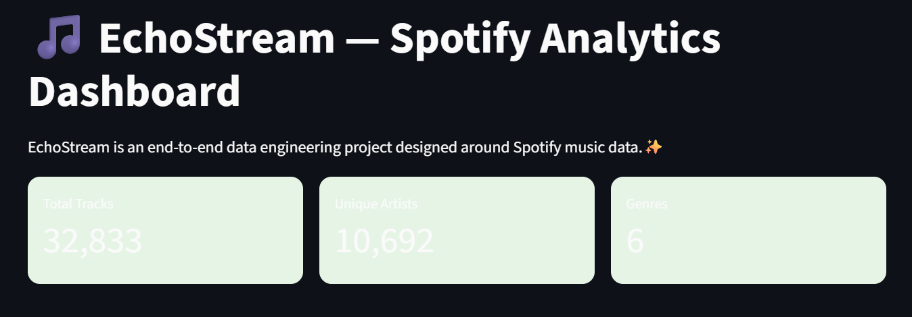
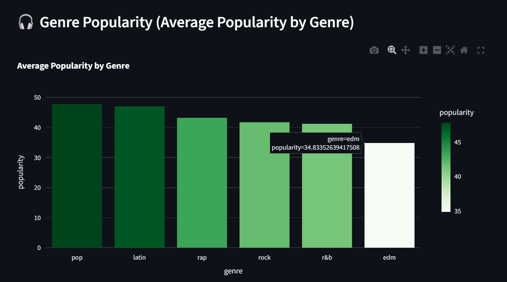
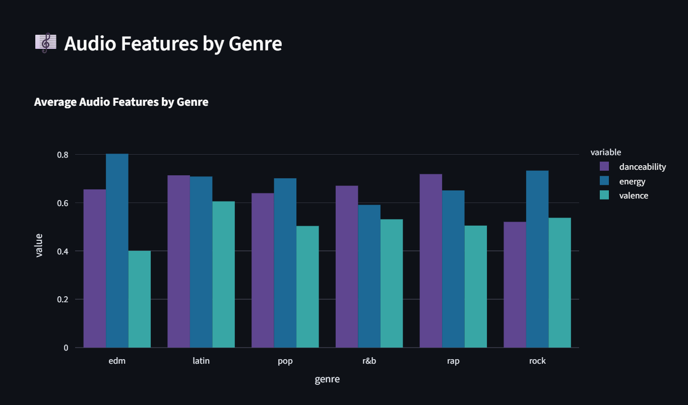
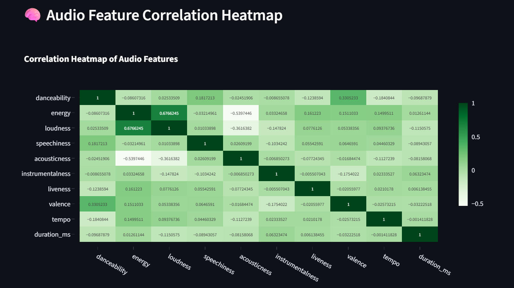
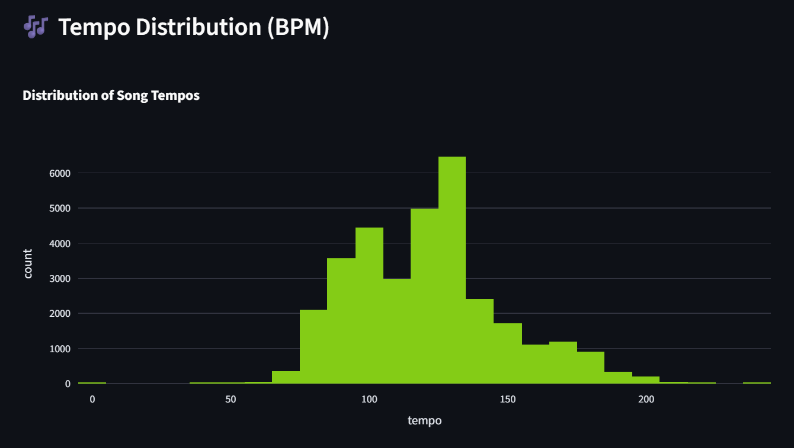
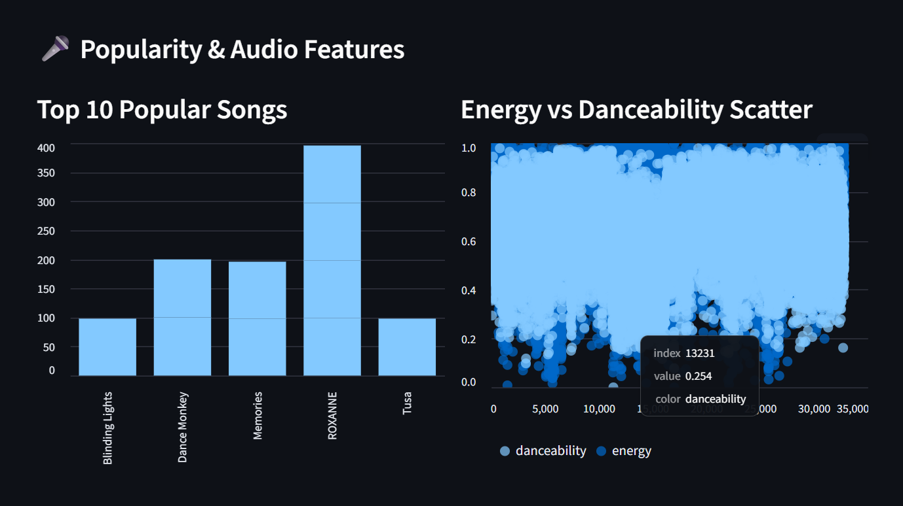

🎵 EchoStream — Spotify Analytics & ETL Pipeline Dashboard

An end-to-end Data Engineering & Analytics Project built using Spotify music data.
EchoStream transforms raw track data into a clean SQLite database and visualizes powerful insights through an interactive Streamlit dashboard.

🚀 Project Overview

EchoStream is designed to mimic a real-world BI/Data Engineering workflow:

Raw Data → ETL Pipeline → SQLite Database → Streamlit Dashboard → Insights

This project highlights:

Data cleaning & transformation

Database creation & management

SQL querying

Interactive analytics dashboards

Visual storytelling with audio features

🏗️ Architecture Diagram

                +----------------+
                |     Raw CSV    |
                +----------------+
                        |
                        v
        +-------------------------------+
        |         Extract (Pandas)       |
        +-------------------------------+
                        |
                        v
        +-------------------------------+
        |    Transform (Cleaning, EDA)   |
        +-------------------------------+
                        |
                        v
        +-------------------------------+
        |      Load (SQLite DB)         |
        +-------------------------------+
                        |
                        v
        +-------------------------------+
        |   Streamlit Analytics App     |
        +-------------------------------+

💾 Tech Stack

Python

pandas, numpy

SQLAlchemy

plotly, streamlit

SQLite

Streamlit

VS Code

Github

📂 Project Structure

ECHOSTREAM/
│
├── data/
│   ├── raw/
│   ├── cleaned/
│   └── db/spotify.db
│
├── src/
│   ├── extract.py
│   ├── transform.py
│   └── load.py
│
├── sql/
│   ├── schema.sql
│   └── queries.sql
│
├── dashboards/
│   ├── app.py
│   └── screenshots/
│       ├── header_kpis.png
│       ├── genre_popularity.png
│       ├── audio_features.png
│       ├── correlation_heatmap.png
│       ├── tempo_distribution.png
│       └── popularity_energy_scatter.png
│
└── README.md

🧼 ETL Pipeline Summary
1. Extract

Load raw CSV data into pandas

Handle missing values

Standardize column names

2. Transform

Remove duplicates

Convert data types

Clean genres & artists

Feature engineering (optional)

3. Load

Create a SQLite database (spotify.db)

Load cleaned dataframe into table spotify_tracks

Use SQLAlchemy for DB operations

📊 Dashboard Features

Your Streamlit dashboard includes:

✔ KPI Metrics

Total Tracks

Unique Artists

Genres Count

✔ Genre Analytics

Popularity by Genre

Audio Features (Danceability, Energy, Valence)

✔ Audio Insights

Correlation Heatmap

Tempo Distribution

Energy vs Danceability Scatter

Scatter Matrix for audio features

✔ Popular Song Insights

Top 10 Most Popular Songs

🖼️ Dashboard Screenshots
Dashboard Header + KPIs

Genre Popularity

Audio Features by Genre

Correlation Heatmap

Tempo Distribution

Popularity & Energy Scatter

